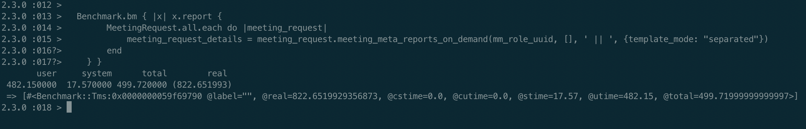
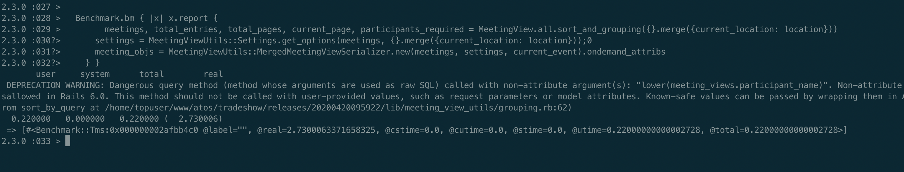

# Rails with postgresql views by leveraging active record entity models

## Problem Statement

We had a use case where we had to generate a report in an existing meeting scheduler system. This report shows all the data of report around meeting. 

While showing the report it involes the most complex logic based on role, meetings, meeting attendees, meeting customer information, meeting notes that being captrued. There are around 20+ filters present around the reports. 

We had to expose an endpoint which gives back information in a format of attendee and respective meeting. It could be csv, excel or any other format. 

## Lets try heavy lifting in ruby

Initial Existing implementaiton we had implemented in ruby. The naive approach will include initialize each object and assoicated objects to the meeting. 

This worked well initally for small amount of data. It started giving performance problems when there are more than 2K meetings and each meeting has approximately 10. Which eventually become 21K objects initialization and storing the data in-memory while processing all of them. 

It takes 10 seconds to retrieve the data and to format it. In a real life scenario, we would have to account for the time needed for the request to go through all the stack, from routing to rendering the views. 10 seconds is a lot of time, specially if you have lots of requests coming.

It started taking more than 60 seconds if the request is having heavy data to manipulate and request.

## Working with postgres views

*&nbsp;&nbsp;&nbsp;&nbsp;&nbsp;&nbsp;&nbsp;&nbsp;&nbsp;&nbsp;&nbsp;&nbsp;&nbsp;&nbsp;&nbsp;&nbsp;Database view is named query that provides another way to present data in the database tables. A view is defined based on one or more tables which are known as base tables. When you create a view, you basically create a query and assign it a name, therefore a view is useful for wrapping a commonly used complex query.*

Postgres has different types of views which are present.
* Logical Views
* Materialized views 

